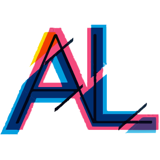
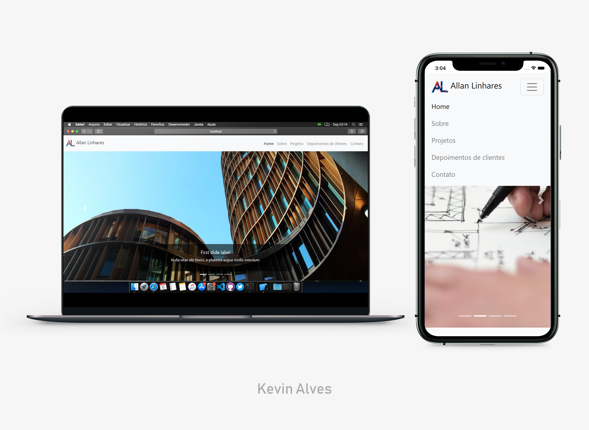

<h1 align="center">
    
</h1>
<h3 align="center">Architecture web page</h3>

<h4 align="center">
  🛸 Stay hungry, stay foolish
</h4>

<div align="center">
    
[]()
[](https://github.com/kevdeveloper/architecture-bootstrap-project/commits/master)
[](/LICENSE)
[](https://github.com/kevdeveloper/architecture-bootstrap-project/issues)
[](https://github.com/kevdeveloper)
[](https://twitter.com/kevinfrontend)
</div>

<p align="center">
<a href="#about">About</a>&nbsp;&nbsp;&nbsp;|&nbsp;&nbsp;&nbsp;
<a href="#installing">Installing</a>&nbsp;&nbsp;&nbsp;|&nbsp;&nbsp;&nbsp;
<a href="#built_using">Built with</a>&nbsp;&nbsp;&nbsp;|&nbsp;&nbsp;&nbsp;
<a href="#author">Author</a>
</p>

<p align="center">
  <a href="" rel="noopener">
  
  </a>
</p>

## 🧐 About <a name = "about"></a>
<h3 align="center"> This is a basic, but elegant archtectural website project, built with bootstarp 4 </h3>


## 🔧 Built with<a name = "built_using"></a>
- [HTML](https://www.w3schools.com/html/) - The standard markup language for Web pages;
- [CSS](https://www.w3schools.com/css/) - The styling language for HTML documents;
- [Bootstrap 4](https://getbootstrap.com/) - The world’s most popular front-end open source toolkit;
- [PhotoShop CC](https://adobe.com/) - The most powerfull photo editor ever made;

### 🛠 Installing <a name = "installing"></a>

```
- Clone or download this repository;
- Unpack (if downloaded);
- Execute index.html on your favorite browser;
```

## ✒️  Autor <a name = "author"></a>

👤 **Kevin Alves**

- Github: [@kevdeveloper](https://github.com/kevdeveloper)
- Twitter: [@kevinfrontend](https://twitter.com/kevinfrontend)
- Linkedin: [@kevinfrontend](https://www.linkedin.com/in/kevinnn/)

## 🤝 Contributing

Contributions, issues and feature requests are welcome!

Feel free to check the [issues page](https://github.com/kevdeveloper/architecture-bootstrap-project/issues).


## 👍 Show your support

Give a ⭐️ if you like this project!


## 📝 License

This project is free to use as learning purposes. For any external content (e.g. logo, images, ...), please contact the proper author and check their license of use.
